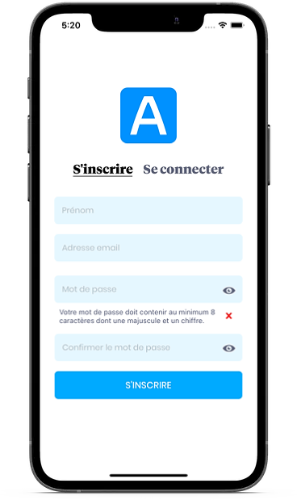
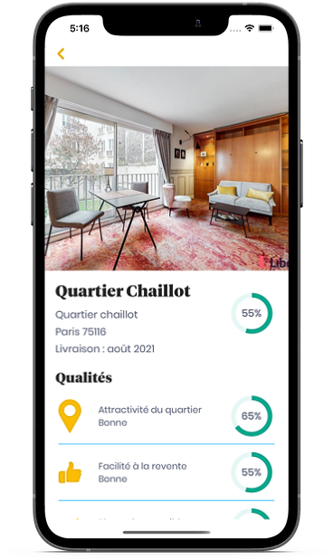
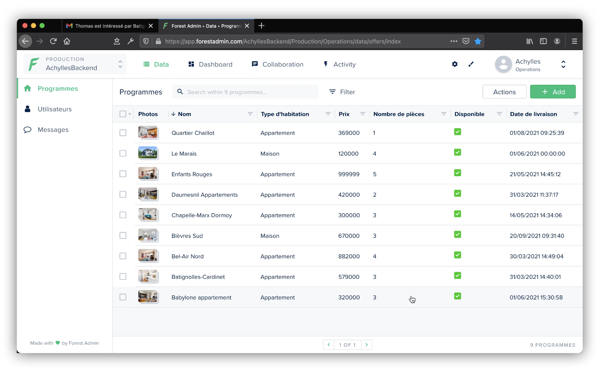
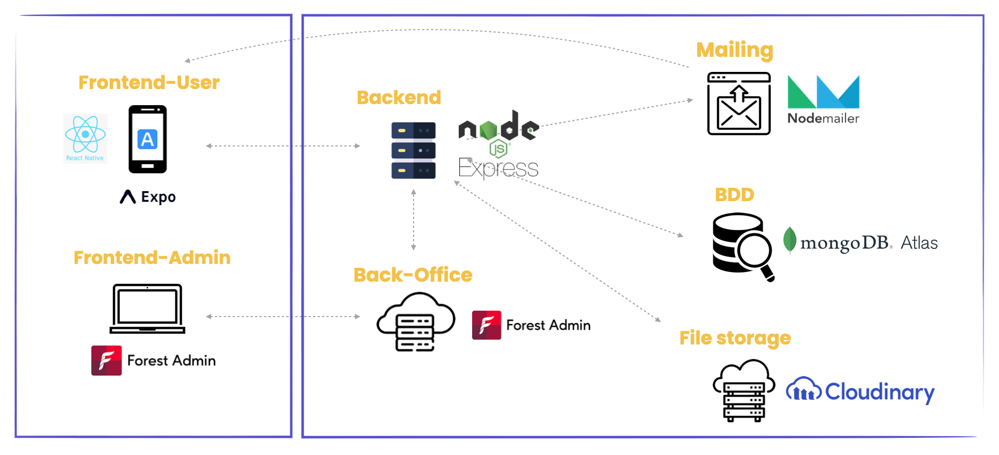

# Achylles MVP

This repository is just a presentation of the Achylles MVP, the source code is private.

## Overview

MVP of a mobile application for French real estate company Achylles. With a multi-step search form and a tinder-like results display this app's ambition is to offer an innovative way to look for your next new-build investment.

### Mobile application adapted for iOS and Android, built with :

-   [React Native](https://reactnative.dev/)
-   [Expo](https://expo.io/)

### Web Back Office built with :

-   [Forest Admin](https://expo.io/)
-   [Mongo DB](https://expo.io/)
-   [Node.js](https://expo.io/)
-   [Express ](https://expo.io/)

## Achylles mobile application

### Features

-   `Signup` with account verification by e-mail
-   `Login`
-   Password : secure password, toggle the visibility of password, change or `reset password`
-   Multi-step search form and settings screen to update user's information (`location autocomplete`, range slider, ...)
-   Geolocated results : user can `swipe` on program and use an `interactive map`
-   Add programs to `favorite`
-   `Contact` Achylles real estate agent with the application
-   `Push notifications` will inform the user when new programs are added
-   Mailing system notifying the user or the admin at each important step

### Screenshots

## Achylles web back office

### Features

-   CRUD on users and programs
-   push programs to user
-   push notifications to user

### Screenshot

## Architecture

### Main packages

-   [expo notifications](https://docs.expo.io/push-notifications/overview/)
-   [mapbox](https://www.mapbox.com/)
-   [mapview](https://github.com/react-native-maps/react-native-maps)
-   [react-native-swiper](https://github.com/leecade/react-native-swiper)
-   [react-native-swiper-flatlist](https://www.npmjs.com/package/react-native-swiper-flatlist)

## Contributors

-   **Cathy Sengmany** - [GitHub Profile](https://github.com/csengmany)
-   **Samy Safsaf** - [GitHub Profile](https://github.com/SamySafsaf)
-   **Teddy Beau** - [GitHub Profile](https://github.com/teddy-beau)
-   **Thomas Bonte** - [GitHub Profile](https://github.com/Thmsbonte)
